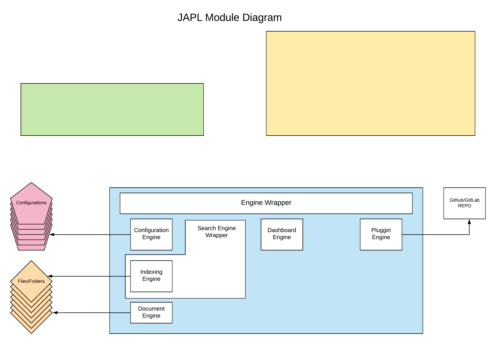

# Folder and File structure

The prject has been devided into 2 components

1. Callisto
2. Engine
3. CLI tool

## Callisto

User interface will contain the code which interacts with the user only. 

Currently the sub-components in UI are:

1. Document interface
2. Dashboard
3. Search Interface 
4. Folder View interface
5. Onboarding interface
6. Configuration Interface
7. Plugin Marketplace
8. Interface Controller
9. Interface Model

## Engine

The bakend will contain all the logic and file handling code.

Currently the sub-components of Backend are:

1. Indexing Engine
2. Engine Wrapper 
3. Search engine wrapper
4. Dasboard engine
5. Document engine
6. Configuration engine
7. Pluggin engine

## CLI tool

Cli tool will provide a fast interface to the engine with least focus on customization and gui.

1. Search Interface
2. Folder/File Interface
3. Configuration Interface
4. Onboarding Interface
5. CLI Plugin interface

[Link to diagram](https://app.lucidchart.com/documents/edit/fb17cc0c-d1c6-42a3-b86d-61532b788407/0_0#?folder_id=home&browser=icon)

